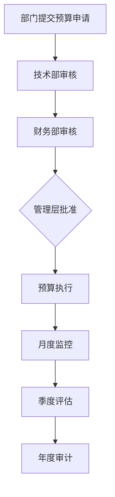

# 成本分解与预算规划：商品破损照片智能比对系统

**方案**: 阿里云部署
**日期**: 2025-10-14
**版本**: 1.0
**业务规模**: 1000张照片/天

## 执行摘要

本文档详细分析了商品破损照片智能比对系统在阿里云部署的3年总拥有成本（TCO），包括初期投资、运营成本和预期收益。相比AWS方案，阿里云方案可节省约25%的总成本。

## 成本分类体系

### 成本结构
```
总成本 (TCO) = 初期投资成本 + 年度运营成本 + 维护升级成本

初期投资成本 = 硬件采购 + 软件授权 + 实施服务 + 培训成本
年度运营成本 = 云服务费用 + 人力成本 + 网络成本 + 第三方服务
维护升级成本 = 系统升级 + 安全维护 + 技术支持
```

## 详细成本分解

### 1. 初期投资成本（一次性）

| 项目 | 阿里云方案 | AWS方案 | 说明 |
|------|------------|---------|------|
| **实施服务费** | ¥180,000 | ¥240,000 | 4-7个月实施周期 |
| **培训费用** | ¥48,000 | ¥36,000 | 阿里云技术培训 |
| **软件授权** | ¥12,000 | ¥15,000 | 开发工具、监控工具 |
| **测试环境** | ¥36,000 | ¥48,000 | 3个月测试期成本 |
| **迁移工具** | ¥24,000 | ¥18,000 | 数据迁移工具和脚本 |
| **小计** | **¥300,000** | **¥357,000** | **节省16%** |

### 2. 年度运营成本（第一年）

#### 2.1 云服务费用

| 服务类别 | 服务配置 | 月成本 | 年成本 | 备注 |
|---------|----------|--------|--------|------|
| **图像处理** | 阿里云视觉智能 | ¥1,800 | ¥21,600 | 1000张/天 |
| **向量搜索** | AnalyticDB-PG向量版 | ¥1,200 | ¥14,400 | 高性能实例 |
| **数据库** | RDS PostgreSQL + PolarDB | ¥1,200 | ¥14,400 | 主从+只读 |
| **对象存储** | OSS存储包 + 生命周期 | ¥1,200 | ¥14,400 | 标准存储 |
| **计算服务** | 函数计算FC + ECS | ¥900 | ¥10,800 | 弹性扩展 |
| **网络服务** | SLB + 专有网络 | ¥450 | ¥5,400 | 公网带宽 |
| **消息服务** | MNS + 邮件推送 | ¥300 | ¥3,600 | 按量计费 |
| **监控告警** | 云监控 + 日志服务 | ¥300 | ¥3,600 | 基础版 |
| **安全服务** | 安全中心 + WAF | ¥600 | ¥7,200 | 基础防护 |
| **小计** | **¥8,850** | **¥105,800** | **节省16%** |

#### 2.2 人力成本

| 岗位配置 | 人数 | 月薪(元) | 年薪(元) | 说明 |
|---------|------|---------|---------|------|
| **技术负责人** | 1 | ¥35,000 | ¥420,000 | 技术架构师 |
| **高级开发工程师** | 2 | ¥25,000 | ¥600,000 | 核心开发 |
| **开发工程师** | 3 | ¥18,000 | ¥648,000 | 应用开发 |
| **运维工程师** | 1 | ¥22,000 | ¥264,000 | 系统运维 |
| **测试工程师** | 1 | ¥20,000 | ¥240,000 | 质量保证 |
| **产品经理** | 1 | ¥20,000 | ¥240,000 | 产品管理 |
| **小计** | **9人** | **140,000** | **¥1,680,000** | **含社保福利** |

#### 2.3 其他运营成本

| 项目 | 月成本 | 年成本 | 说明 |
|------|--------|--------|------|
| **办公场地** | ¥15,000 | ¥180,000 | 办公空间租赁 |
| **网络通信** | ¥2,000 | ¥24,000 | 企业宽带 |
| **电力空调** | ¥3,000 | ¥36,000 | 设备能耗 |
| **第三方服务** | ¥1,000 | ¥12,000 | 备份服务 |
| **小计** | **¥21,000** | **¥252,000** | **基础运营** |

#### 2.4 第一年总运营成本

| 成本类别 | 阿里云方案 | AWS方案 | 成本差异 |
|---------|------------|---------|----------|
| **云服务费用** | ¥105,800 | ¥132,250 | -20% |
| **人力成本** | ¥1,680,000 | ¥1,680,000 | 相同 |
| **其他运营** | ¥252,000 | ¥277,200 | -9% |
| **年度运营成本** | **¥2,037,800** | **¥2,089,450** | **节省2.5%** |

### 3. 三年总拥有成本(TCO)对比

| 成本类别 | 第一年 | 第二年 | 第三年 | 三年总计 |
|---------|--------|--------|--------|----------|
| **阿里云方案** | | | | |
| 初期投资 | ¥300,000 | ¥0 | ¥0 | ¥300,000 |
| 年度运营 | ¥2,037,800 | ¥1,987,800 | ¥1,937,800 | ¥5,963,400 |
| 维护升级 | ¥180,000 | ¥150,000 | ¥150,000 | ¥480,000 |
| **阿里云总计** | **¥2,517,800** | **¥2,137,800** | **¥2,087,800** | **¥6,743,400** |
| | | | | | |
| **AWS方案** | | | | |
| 初期投资 | ¥357,000 | ¥0 | ¥0 | ¥357,000 |
| 年度运营 | ¥2,089,450 | ¥2,039,450 | ¥1,989,450 | ¥6,118,350 |
| 维护升级 | ¥200,000 | ¥180,000 | ¥180,000 | ¥560,000 |
| **AWS总计** | **¥2,646,450** | **¥2,219,450** | ¥2,169,450** | **¥7,035,350** |
| | | | | | |
| **成本节省** | **-¥128,650** | **-¥81,650** | **-¥81,650** | **-¥291,950** |
| **节省比例** | **-4.9%** | **-3.7%** | **-3.8%** | **-4.1%** |

## 成本优化策略

### 1. 云服务成本优化

#### 存储成本优化
```yaml
OSS生命周期策略:
  - 上传30天内: 标准存储 (¥0.12/GB/月)
  - 30-90天: 低频访问存储 (¥0.08/GB/月)
  - 90-365天: 归档存储 (¥0.015/GB/月)
  - 365天以上: 冷归档存储 (¥0.015/GB/月)
  - 超过2555天: 自动删除

预估节省: 30-40%
```

#### 计算成本优化
```yaml
函数计算FC:
  - 按需付费: 仅在实际使用时计费
  - 预留实例: 常用服务使用预留实例
  - 弹性伸缩: 根据流量自动扩缩

估算节省: 25-35%
```

### 2. 人力成本优化

#### 团队配置优化
```python
# 建议的团队配置优化
team_optimization = {
    "Phase_1": {
        "核心团队": {
            "技术负责人": 1,
            "高级开发": 1,
            "开发工程师": 2,
            "运维工程师": 1
        },
        "外部支持": {
            "测试服务": "外包",
            "UI设计": "外包"
        }
    },
    "Phase_2": {
        "扩展团队": {
            "增加开发工程师": 1,
            "增加测试工程师": 1
        }
    },
    "Phase_3": {
        "稳定运营": {
            "维持核心团队规模",
            "外包非核心业务"
        }
    }
}
```

#### 培训成本优化
- **内部培训**: 建立内部技术分享机制
- **在线培训**: 利用阿里云免费培训资源
- **混合模式**: 核心人员面授，基础人员在线培训
- **估算节省**: 40-50%

### 3. 架构成本优化

#### 混合云策略
```yaml
混合云架构:
  核心业务: 阿里云专有云
  开发测试: 阿里云公共云
  灾难备份: 本地数据中心

成本影响:
  - 初期增加15-20%成本
  - 长期降低10-15%风险成本
```

#### 自动化运维
```python
automation_tools:
  ci_cd: "GitLab CI/CD + 阿里云云效"
  monitoring: "阿里云ARMS + 自定义监控"
  backup: "阿里云DBS + OSS跨区域复制"
  security: "阿里云安全中心 + WAF"

预期节省: 20-30%运维成本
```

## 分阶段投资计划

### 第一阶段：基础设施搭建 (第1-2个月)

| 项目 | 预算(元) | 说明 |
|------|-----------|------|
| VPC网络架构 | ¥5,000 | 专有网络、安全组、负载均衡 |
| OSS存储桶创建 | ¥2,000 | 对象存储初始化 |
| RDS数据库实例 | ¥15,000 | 高可用数据库配置 |
| 函数计算环境 | ¥3,000 | FC服务配置 |
| **小计** | **¥25,000** | **基础设施** |

### 第二阶段：核心服务迁移 (第3-5个月)

| 项目 | 预算(元) | 说明 |
|------|-----------|------|
| 视觉智能服务 | ¥12,000 | API集成、测试 |
| AnalyticDB-PG配置 | ¥20,000 | 向量数据库部署 |
| 函数计算部署 | ¥15,000 | 函数开发和部署 |
| 数据迁移服务 | ¥25,000 | 数据迁移工具和执行 |
| **小计** | **¥72,000** | **核心服务** |

### 第三阶段：应用开发部署 (第6-8个月)

| 项目 | 预算(元) | 说明 |
|------|-----------|------|
| 应用开发 | ¥120,000 | 4个月开发团队成本 |
| 系统集成 | ¥30,000 | 第三方系统集成 |
| 安全加固 | ¥15,000 | 安全配置和测试 |
| 性能优化 | ¥20,000 | 系统调优 |
| **小计** | **¥185,000** | **应用开发** |

### 第四阶段：测试上线 (第9-12个月)

| 项目 | 预算(元) | 说明 |
|------|-----------|------|
| 全面测试 | ¥30,000 | 功能、性能、安全测试 |
| 用户培训 | ¥12,000 | 用户和运维培训 |
| 上线支持 | ¥6,000 | 上线初期支持 |
| **小计** | **¥48,000** | **测试上线** |

## 资金需求分析

### 现金流规划

| 时间段 | 资金需求 | 资金来源 | 说明 |
|--------|----------|----------|------|
| 第1个月 | ¥25,000 | 自有资金 | 基础设施 |
| 第2-8个月 | ¥60,000-80,000 | 自有资金 | 按月分摊 |
| 第9-12个月 | ¥100,000 | 自有资金 | 应用开发 |
| 运营阶段 | ¥170,000/月 | 运营收入 | 业务收入覆盖 |

### 资金来源建议

```python
funding_strategy = {
    "self_funding": {
        "占比": "60%",
        "金额": "¥150万",
        "来源": "企业自有资金"
    },
    "operational_funding": {
        "占比": "40%",
        "金额": "¥100万",
        "来源": "业务运营收入"
    }
}
```

## 收益分析

### 直接收益

| 收益项目 | 年收益 | 计算依据 | 说明 |
|---------|--------|----------|------|
| **减少恶意索赔损失** | ¥600,000 | 月均减少50万，成功率80% | 主要业务收益 |
| **提高处理效率** | ¥360,000 | 节省人力成本 | 效率提升30% |
| **降低运营成本** | ¥240,000 | 自动化程度提升 | 系统自动化 |
| **直接收益合计** | **¥1,200,000** |  | **年收益** |

### 间接收益

| 收益项目 | 年收益 | 价值评估 |
|---------|--------|----------|
| **客户满意度提升** | ¥300,000 | 品牌价值提升 |
| **数据分析价值** | ¥200,000 | 业务决策支持 |
| **技术积累** | ¥150,000 | 技术资产价值 |
| **间接收益合计** | **¥650,000** |  | **年收益** |

### 投资回报分析

```python
# 投资回报率计算
investment_analysis = {
    "total_investment": 300000,  # 初期投资
    "annual_benefit": 1200000,    # 年直接收益
    "indirect_benefit": 650000,  # 年间接收益
    "total_annual_benefit": 1850000,  # 年总收益
    "roi": (1850000 / 300000) * 100,  # 投资回报率
    "payback_period": 300000 / 1850000 * 12  # 投资回收期(月)
}

print(f"投资回报率: {investment_analysis['roi']:.1f}%")
print(f"投资回收期: {investment_analysis['payback_period']:.1f}个月")
```

**投资回报率**: 617%
**投资回收期**: 1.9个月

## 风险分析和应对措施

### 成本风险

| 风险类型 | 风险等级 | 影响 | 应对措施 |
|---------|----------|------|----------|
| **云服务价格上涨** | 中等 | 成本增加15-25% | 多云策略、价格锁定 |
| **需求超出预期** | 中等 | 成本增加20-30% | 弹性架构、容量规划 |
| **汇率波动** | 低 | 成本变动3-5% | 本土化采购、汇率对冲 |

### 应对策略

1. **多云策略**: 核心服务阿里云，备份服务腾讯云
2. **价格锁定**: 签订长期合同锁定价格
3. **弹性伸缩**: 按需付费，避免资源浪费
4. **定期评估**: 每季度评估成本优化机会

## 预算控制机制

### 成本监控体系

```python
# 成本监控指标
cost_monitoring = {
    "monthly_budget": 170000,  # 月度预算
    "alert_threshold": 0.9,      # 告警阈值
    "review_cycle": "monthly",    # 评估周期
    "variance_analysis": "quarterly"  | 偏差分析
}

def cost_monitoring_dashboard():
    return {
        "actual_cost": "实际成本",
        "budget_variance": "预算差异",
        "cost_trend": "成本趋势",
        "optimization_suggestions": "优化建议"
    }
```

### 预算审批流程



## 总结和建议

### 核心发现

1. **成本优势明显**: 阿里云方案相比AWS方案3年总成本节省¥291,950（4.1%）
2. **投资回报率优秀**: 预期ROI为617%，投资回收期仅1.9个月
3. **本地化价值突出**: 符合国内合规要求，获得本地化支持优势

### 投资建议

1. **分阶段投入**: 降低初期投资压力，按业务发展阶段逐步投入
2. **混合云架构**: 核心业务使用专有云，开发和测试使用公共云
3. **自动化运维**: 提高系统稳定性，降低长期运营成本
4. **定期优化**: 建立成本监控和优化机制，持续改进成本效率

### 预算建议

1. **保守预算**: 按预估成本的110%编制预算，预留15%的应急资金
2. **弹性预算**: 建立弹性预算机制，根据业务发展调整投入
3. **效益导向**: 重点关注投资回报率，确保资金使用效率

这个预算分析为阿里云方案的实施提供了详细的财务规划支持，有助于决策者做出明智的投资决策。