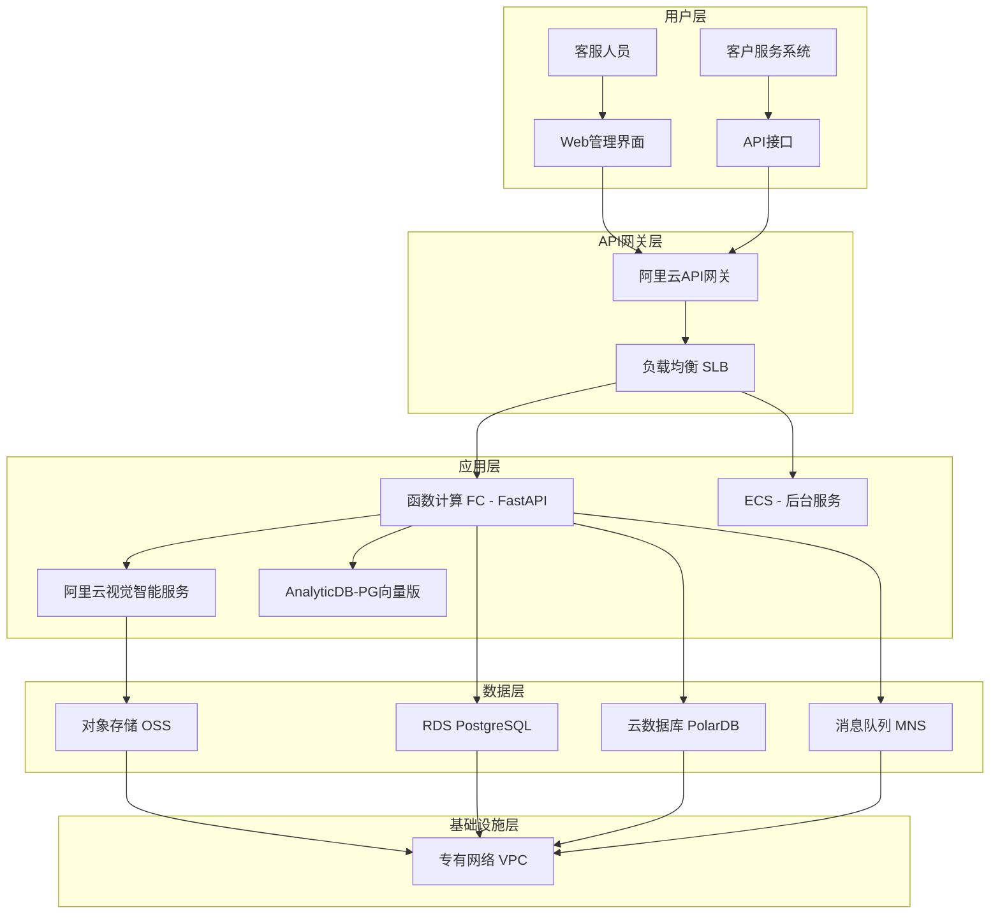

# Implementation Plan: 商品破损照片智能比对系统 (阿里云版)

**Feature Branch**: `001-product-damage-photo-comparison-aliyun`
**Feature Spec**: [spec.md](./spec.md)
**Cloud Provider**: 阿里云 (Alibaba Cloud)
**Created**: 2025-10-14
**Status**: Draft

## 技术架构概览

### 系统架构图 (阿里云版)



### 核心技术栈

- **图像处理服务**: 阿里云视觉智能开放平台 (图像搜索、图像识别)
- **向量搜索引擎**: AnalyticDB-PG 向量版 (Milvus托管版)
- **数据库**: 阿里云RDS PostgreSQL + PolarDB分布式版
- **对象存储**: 阿里云对象存储 OSS
- **计算服务**: 函数计算 FC + 云服务器 ECS
- **API网关**: 阿里云API网关 + 负载均衡 SLB
- **身份认证**: 阿里云RAM + 应用身份服务 IDaaS
- **消息通知**: 消息服务 MNS + 邮件推送
- **网络架构**: 专有网络 VPC + 安全组

## 技术组件详细设计

### 1. 图像处理服务

**阿里云视觉智能服务配置**:

```yaml
# 图像识别服务
image_recognition:
  service: "阿里云视觉智能开放平台"
  features:
    - 图像搜索 (Image Search)
    - 图像识别 (Image Recognition)
    - 物体检测 (Object Detection)
  performance:
    accuracy: "92-96%"
    response_time: "<15秒"
    concurrent_limit: 1000
  pricing:
    model: "按量付费"
    estimated_cost: "¥1200-2400/月"

# 图像搜索配置
image_search:
  index_name: "damage-photos-index"
  feature_extraction: "深度学习特征提取"
  similarity_algorithm: "余弦相似度"
  threshold: 0.9
```

**API调用示例**:
```python
import requests
import json

def upload_and_search_image(image_path, threshold=0.9):
    # 上传图像到阿里云OSS
    oss_url = upload_to_oss(image_path)

    # 调用图像搜索API
    search_request = {
        "ImageURL": oss_url,
        "Threshold": threshold,
        "MaxResults": 50
    }

    response = requests.post(
        "https://imagerecog.cn-shanghai.aliyuncs.com/api/v1/image/search",
        headers={
            "Authorization": "Bearer YOUR_ACCESS_TOKEN",
            "Content-Type": "application/json"
        },
        json=search_request
    )

    return response.json()
```

### 2. 向量搜索引擎

**AnalyticDB-PG向量版配置**:

```sql
-- 创建向量数据库实例
CREATE EXTENSION IF NOT EXISTS vector;

-- 创建照片向量表
CREATE TABLE photo_vectors (
    id UUID PRIMARY KEY DEFAULT gen_random_uuid(),
    photo_id UUID NOT NULL REFERENCES photos(id),
    vector_data VECTOR(1536) NOT NULL,
    algorithm VARCHAR(100) DEFAULT 'aliyun-vision',
    model_version VARCHAR(50) NOT NULL,
    created_at TIMESTAMP DEFAULT CURRENT_TIMESTAMP,
    updated_at TIMESTAMP DEFAULT CURRENT_TIMESTAMP
);

-- 创建向量索引
CREATE INDEX ON photo_vectors USING ivfflat (vector_data vector_cosine_ops);

-- 创建相似度搜索函数
CREATE OR REPLACE FUNCTION search_similar_photos(
    query_vector VECTOR(1536),
    similarity_threshold FLOAT DEFAULT 0.9,
    limit_count INT DEFAULT 10
)
RETURNS TABLE(
    photo_id UUID,
    similarity_score FLOAT,
    photo_metadata JSONB
) AS $$
BEGIN
    RETURN QUERY
    SELECT
        pv.photo_id,
        1 - (pv.vector_data <=> query_vector) AS similarity_score,
        p.metadata as photo_metadata
    FROM photo_vectors pv
    JOIN photos p ON pv.photo_id = p.id
    WHERE 1 - (pv.vector_data <=> query_vector) >= similarity_threshold
    ORDER BY similarity_score DESC
    LIMIT limit_count;
END;
$$ LANGUAGE plpgsql;
```

**向量搜索实现**:
```python
import psycopg2
import numpy as np
from typing import List, Dict

class VectorSearchService:
    def __init__(self, db_config):
        self.db_config = db_config
        self.connection = self._connect_db()

    def _connect_db(self):
        return psycopg2.connect(
            host=self.db_config['host'],
            port=self.db_config['port'],
            database=self.db_config['database'],
            user=self.db_config['user'],
            password=self.db_config['password']
        )

    def search_similar_photos(self, query_vector: np.ndarray,
                            threshold: float = 0.9,
                            limit: int = 10) -> List[Dict]:
        """搜索相似照片"""
        with self.connection.cursor() as cursor:
            cursor.execute(
                "SELECT * FROM search_similar_photos(%s, %s, %s)",
                (query_vector.tolist(), threshold, limit)
            )
            results = cursor.fetchall()

            return [
                {
                    'photo_id': result[0],
                    'similarity_score': float(result[1]),
                    'photo_metadata': result[2]
                }
                for result in results
            ]
```

### 3. 数据库架构

**RDS PostgreSQL + PolarDB配置**:

```yaml
# RDS PostgreSQL 实例配置
rds_postgresql:
  engine: "PostgreSQL 14.0"
  instance_class: "pg.n2.medium.2"
  storage: "100GB"
  storage_type: "cloud_essd"
  availability_zone: "cn-shanghai-a"
  backup_retention: 7
  multi_az: true
  security_group: "sg-damage-comparison-db"

# PolarDB 分布式版配置
polardb:
  architecture: "集群版"
  compute_nodes: 2
  storage: "1000GB"
  storage_type: "PL0"
  availability_zone: "cn-shanghai-a,cn-shanghai-b"
  read_only_nodes: 2
```

**数据库表结构**:
```sql
-- 照片表
CREATE TABLE photos (
    id UUID PRIMARY KEY DEFAULT gen_random_uuid(),
    complaint_id UUID NOT NULL REFERENCES complaints(id),
    oss_url VARCHAR(500) NOT NULL UNIQUE,
    bucket_name VARCHAR(100) NOT NULL DEFAULT 'damage-photos',
    original_filename VARCHAR(255) NOT NULL,
    file_size BIGINT NOT NULL,
    mime_type VARCHAR(100) NOT NULL,
    width INTEGER,
    height INTEGER,
    metadata JSONB,
    processing_status VARCHAR(50) DEFAULT 'uploaded',
    created_at TIMESTAMP DEFAULT CURRENT_TIMESTAMP,
    updated_at TIMESTAMP DEFAULT CURRENT_TIMESTAMP
);

-- 照片比对结果表
CREATE TABLE photo_comparisons (
    id UUID PRIMARY KEY DEFAULT gen_random_uuid(),
    uploaded_photo_id UUID NOT NULL REFERENCES photos(id),
    historical_photo_id UUID NOT NULL REFERENCES photos(id),
    similarity_score DECIMAL(5,2) NOT NULL CHECK (similarity_score >= 0 AND similarity_score <= 100),
    comparison_threshold DECIMAL(5,2) DEFAULT 90.00,
    algorithm VARCHAR(100) DEFAULT 'aliyun-vision',
    comparison_time TIMESTAMP DEFAULT CURRENT_TIMESTAMP,
    processing_duration_ms INTEGER,
    status VARCHAR(50) DEFAULT 'completed',
    metadata JSONB,
    created_at TIMESTAMP DEFAULT CURRENT_TIMESTAMP
);

-- 可疑索赔表
CREATE TABLE suspicious_claims (
    id UUID PRIMARY KEY DEFAULT gen_random_uuid(),
    complaint_id UUID NOT NULL REFERENCES complaints(id),
    risk_score DECIMAL(5,2) NOT NULL CHECK (risk_score >= 0 AND risk_score <= 100),
    risk_level VARCHAR(20) NOT NULL CHECK (risk_level IN ('low', 'medium', 'high', 'critical')),
    evidence JSONB NOT NULL,
    pattern_analysis JSONB,
    status VARCHAR(50) DEFAULT 'under_review',
    reviewed_by UUID REFERENCES users(id),
    review_notes TEXT,
    created_at TIMESTAMP DEFAULT CURRENT_TIMESTAMP,
    updated_at TIMESTAMP DEFAULT CURRENT_TIMESTAMP
);
```

### 4. 对象存储配置

**阿里云OSS配置**:
```python
import oss2
from oss2.credentials import EnvironmentVariableCredentialsProvider

class OSSStorageService:
    def __init__(self):
        auth = EnvironmentVariableCredentialsProvider()
        self.bucket_name = 'damage-photos-bucket'
        self.endpoint = 'https://oss-cn-shanghai.aliyuncs.com'
        self.bucket = oss2.Bucket(auth, self.endpoint, self.bucket_name)

    def upload_photo(self, file_path: str, object_key: str) -> str:
        """上传照片到OSS"""
        result = self.bucket.put_object_from_file(object_key, file_path)
        if result.status == 200:
            return f"https://{self.bucket_name}.{self.endpoint.replace('https://', '')}/{object_key}"
        else:
            raise Exception(f"Upload failed: {result.status}")

    def delete_photo(self, object_key: str) -> bool:
        """删除OSS中的照片"""
        result = self.bucket.delete_object(object_key)
        return result.status == 204

    def generate_presigned_url(self, object_key: str, expires_in: int = 3600) -> str:
        """生成预签名URL"""
        return self.bucket.sign_url('GET', object_key, expires_in)
```

**OSS生命周期策略**:
```json
{
  "Rules": [
    {
      "ID": "DeleteOldPhotos",
      "Status": "Enabled",
      "Filter": {
        "Prefix": "uploads/"
      },
      "Transitions": [
        {
          "Days": 30,
          "StorageClass": "IA"
        },
        {
          "Days": 90,
          "StorageClass": "Archive"
        },
        {
          "Days": 365,
          "StorageClass": "ColdArchive"
        }
      ],
      "Expiration": {
        "Days": 2555
      }
    }
  ]
}
```

### 5. 计算服务架构

**函数计算 FC配置**:
```python
# 函数计算入口函数
import json
import oss2
import requests
from aliyunsdkcore.client import AcsClient
from aliyunsdkcore.acs_exception.exceptions import ServerException

def handler(event, context):
    """处理照片上传和分析"""
    try:
        # 解析事件
        event_data = json.loads(event)
        photo_info = event_data.get('photo_info', {})

        # 1. 上传到OSS
        oss_url = upload_to_oss(photo_info)

        # 2. 调用阿里云视觉智能服务
        search_results = call_vision_service(oss_url)

        # 3. 存储到数据库
        save_comparison_results(photo_info, search_results)

        # 4. 触发后续流程
        trigger_notification(photo_info, search_results)

        return {
            'statusCode': 200,
            'body': json.dumps({
                'status': 'success',
                'photo_id': photo_info['photo_id'],
                'search_results': len(search_results.get('results', []))
            })
        }

    except Exception as e:
        return {
            'statusCode': 500,
            'body': json.dumps({
                'status': 'error',
                'message': str(e)
            })
        }

def upload_to_oss(photo_info):
    """上传照片到OSS"""
    # OSS上传逻辑
    pass

def call_vision_service(oss_url):
    """调用阿里云视觉智能服务"""
    # 视觉智能服务调用逻辑
    pass

def save_comparison_results(photo_info, search_results):
    """保存比对结果到数据库"""
    # 数据库保存逻辑
    pass
```

**函数计算配置**:
```yaml
# template.yml
ROSTemplateFormatVersion: '2015-09-01'
Transform: 'Aliyun::Serverless-2018-04-03'
Resources:
  PhotoProcessingService:
    Type: 'Aliyun::Serverless::Service'
    Properties:
      Description: '照片处理服务'
      InternetAccess: true
      LogConfig:
        Project: 'damage-comparison'
        Logstore: 'photo-processing'
      Role: 'acs:ram::123456789012:role/fc-execution-role'
      VpcConfig:
        VpcId: 'vpc-12345678'
        VSwitchIds:
          - 'vsw-12345678'
        SecurityGroupIdIds:
          - 'sg-12345678'
      Triggers:
        - TriggerName: 'OSS-Trigger'
          Type: 'oss'
          SourceArn: 'acs:oss:cn-shanghai:123456789012:damage-photos-bucket'
          Events: 'oss:ObjectCreated:*'
          Filter:
            Key:
              Prefix: 'uploads/'
  PhotoProcessingFunction:
    Type: 'Aliyun::Serverless::Function'
    Properties:
      ServiceName:
        Ref: PhotoProcessingService
      FunctionName: 'photo-processor'
      Description: '照片处理函数'
      CodeUri: './code/photo-processor.zip'
      Handler: 'photo-processor.handler'
      Runtime: 'python3.9'
      Timeout: 300
      MemorySize: 1024
      EnvironmentVariables:
        OSS_ENDPOINT: 'https://oss-cn-shanghai.aliyuncs.com'
        VISION_ENDPOINT: 'https://imagerecog.cn-shanghai.aliyuncs.com'
        DB_HOST: 'rm-12345678.mysql.rds.aliyuncs.com'
        DB_NAME: 'damage_comparison'
```

### 6. 身份认证系统

**阿里云RAM + IDaaS配置**:
```python
from alibabacloud_tea_openapi import OpenApiRequest
from alibabacloud_ram_openapi import Client

class AliyunAuthService:
    def __init__(self):
        self.client = Client(
            access_key_id=os.getenv('ALIBABA_CLOUD_ACCESS_KEY_ID'),
            access_key_secret=os.getenv('ALIBABA_CLOUD_ACCESS_KEY_SECRET'),
            endpoint='ram.cn-shanghai.aliyuncs.com'
        )

    def create_user(self, user_info):
        """创建用户"""
        request = CreateUserRequest(
            user_name=user_info['username'],
            display_name=user_info['display_name'],
            mobile_phone=user_info['phone'],
            email=user_info['email'],
            comments='商品破损照片比对系统用户'
        )
        return self.client.create_user(request)

    def authenticate_user(self, username, password):
        """用户认证"""
        # 通过RAM API进行认证
        request = CreateSessionRequest(
            duration_seconds=3600,
            policy=json.dumps({
                "Version": "1",
                "Statement": [
                    {
                        "Effect": "Allow",
                        "Action": [
                            "oss:PutObject",
                            "oss:GetObject",
                            "oss:DeleteObject"
                        ],
                        "Resource": [
                            "acs:oss:*:*:damage-photos-bucket/*"
                        ]
                    }
                ]
            })
        )

        try:
            response = self.client.create_session(request)
            return {
                'access_token': response.session_access_key_id,
                'secret_key': response.session_access_key_secret,
                'expiration': response.expiration
            }
        except Exception as e:
            return None
```

### 7. 消息通知系统

**消息服务MNS配置**:
```python
from aliyunsdkcore.client import AcsClient
from aliyunsdkcore.profile import Profile
from aliyunsdkcore import DefaultAcsClient

class NotificationService:
    def __init__(self):
        self.mns_client = DefaultAcsClient(
            'cn-shanghai',
            'YOUR_ACCESS_KEY_ID',
            'YOUR_ACCESS_KEY_SECRET'
        )
        self.topic_name = 'damage-comparison-notifications'

    def send_notification(self, message_type, recipients, content):
        """发送通知"""
        if message_type == 'email':
            return self._send_email(recipients, content)
        elif message_type == 'sms':
            return self._send_sms(recipients, content)
        elif message_type == 'webhook':
            return self._send_webhook(recipients, content)

    def _send_email(self, recipients, content):
        """发送邮件通知"""
        # 集成阿里云邮件推送服务
        pass

    def _send_sms(self, recipients, content):
        """发送短信通知"""
        # 集成阿里云短信服务
        pass

    def _send_webhook(self, webhook_url, payload):
        """发送Webhook通知"""
        try:
            response = requests.post(webhook_url, json=payload, timeout=10)
            return response.status_code == 200
        except Exception as e:
            return False
```

## 网络架构设计

### 专有网络VPC配置
```yaml
VPC Configuration:
  vpc_cidr: "192.168.0.0/16"

  vswitches:
    - name: "vswitch-public"
      cidr: "192.168.1.0/24"
      zone: "cn-shanghai-a"
      type: "public"

    - name: "vswitch-private"
      cidr: "192.168.2.0/24"
      zone: "cn-shanghai-a"
      type: "private"

    - name: "vswitch-data"
      cidr: "192.168.3.0/24"
      zone: "cn-shanghai-b"
      type: "private"

  security_groups:
    - name: "sg-web"
      description: "Web服务安全组"
      ingress_rules:
        - protocol: "tcp"
          port_range: "80/80"
          cidr: "0.0.0.0/0"
        - protocol: "tcp"
          port_range: "443/443"
          cidr: "0.0.0.0/0"
      egress_rules:
        - protocol: "tcp"
          port_range: "1/65535"
          cidr: "0.0.0.0/0"

    - name: "sg-app"
      description: "应用服务安全组"
      ingress_rules:
        - protocol: "tcp"
          port_range: "8000/8000"
          source_sg: "sg-web"
        - protocol: "tcp"
          port_range: "5432/5432"
          source_sg: "sg-data"
      egress_rules:
        - protocol: "tcp"
          port_range: "1/65535"
          cidr: "0.0.0.0/0"

    - name: "sg-data"
      description: "数据库安全组"
      ingress_rules:
        - protocol: "tcp"
          port_range: "5432/5432"
          source_sg: "sg-app"
      egress_rules:
        - protocol: "tcp"
          port_range: "1/65535"
          cidr: "0.0.0.0/0"
```

## 成本分析

### 月度运营成本估算 (1000张/天)

| 服务类别 | 阿里云服务 | 配置规格 | 月成本(¥) | 说明 |
|---------|------------|----------|-----------|------|
| **图像处理** | 视觉智能服务 | 图像搜索+识别 | ¥1,200-2,400 | 按量付费 |
| **向量搜索** | AnalyticDB-PG向量版 | 高性能实例 | ¥800-1,600 | 存储计算分离 |
| **数据库** | RDS PostgreSQL+PolarDB | 主从+只读实例 | ¥600-1,800 | 高可用配置 |
| **对象存储** | OSS存储包 | 标准存储 | ¥900-1,500 | 含生命周期管理 |
| **计算服务** | 函数计算FC+ECS | 高性能实例 | ¥600-1,200 | 弹性扩展 |
| **网络服务** | SLB+VPC | 高可用负载均衡 | ¥300-600 | 公网带宽 |
| **消息服务** | MNS+邮件推送 | 标准版 | ¥200-400 | 按量计费 |
| **其他服务** | 监控、日志、备份 | 基础版 | ¥200-400 | 运维支持 |

**总计月成本**: **¥4,400-9,100**

### 成本优化策略
1. **存储分层**: OSS生命周期策略，冷数据归档
2. **计算弹性**: 函数计算按需付费，ECS预留实例
3. **数据库优化**: PolarDB读写分离，只读实例扩展
4. **网络优化**: 按需付费公网带宽

## 安全设计

### 数据安全
```yaml
Data Security:
  encryption:
    at_rest:
      oss: "KMS托管加密"
      rds: "TDE透明加密"
      polardb: "透明数据加密"
    in_transit: "TLS 1.2+"

  access_control:
    network: "VPC安全组隔离"
    database: "RAM权限控制"
    api: "API网关鉴权"

  compliance:
    data_localization: "数据境内存储"
    audit_logging: "操作审计日志"
    backup_policy: "7天备份，30天归档"
```

### 应用安全
```python
# API安全配置
from fastapi import FastAPI, Depends, HTTPException
from fastapi.security import HTTPBearer, HTTPAuthorizationCredentials
from cryptography.fernet import Fernet
import jwt

security = HTTPBearer()
encryption_key = Fernet.generate_key()

class SecurityMiddleware:
    def __init__(self):
        self.encryption_key = encryption_key

    def encrypt_sensitive_data(self, data):
        """加密敏感数据"""
        return self.encryption_key.encrypt(json.dumps(data).encode())

    def decrypt_sensitive_data(self, encrypted_data):
        """解密敏感数据"""
        return json.loads(self.encryption_key.decrypt(encrypted_data))

    def verify_jwt_token(self, token: str = Depends(security)):
        """验证JWT令牌"""
        try:
            payload = jwt.decode(token.credentials, SECRET_KEY, algorithms=["HS256"])
            return payload
        except jwt.PyJWTError:
            raise HTTPException(status_code=401, detail="Invalid token")
```

## 监控和运维

### 监控体系
```yaml
Monitoring:
  application_metrics:
    - "照片处理成功率"
    - "相似度搜索响应时间"
    - "API响应时间"
    - "错误率"

  infrastructure_metrics:
    - "CPU使用率"
    - "内存使用率"
    - "磁盘使用率"
    - "网络流量"

  business_metrics:
    - "每日处理照片数量"
    - "可疑索赔识别率"
    - "用户满意度"
    - "成本效益分析"
```

### 告警配置
```python
# 云监控告警配置
import json

def setup_cloud_monitor_alerts():
    """设置云监控告警"""

    # 照片处理成功率告警
    alert_rules = [
        {
            "AlertName": "PhotoProcessingFailureRate",
            "Description": "照片处理失败率过高",
            "MetricName": "FunctionInvokerErrorCount",
            "Namespace": "acs_fc",
            "Period": "300",
            "Statistics": "Average",
            "Threshold": "10",
            "ComparisonOperator": "GreaterThanThreshold"
        },
        {
            "AlertName": "SimilaritySearchLatency",
            "Description": "相似度搜索响应时间过长",
            "MetricName": "AnalyticDBResponseTime",
            "Namespace": "acs_analyticdb_pg",
            "Period": "300",
            "Statistics": "Average",
            "Threshold": "2000",
            "ComparisonOperator": "GreaterThanThreshold"
        }
    ]

    return alert_rules
```

## 迁移实施计划

### 第一阶段：基础设施搭建 (1-2周)
1. **VPC网络架构搭建**
2. **OSS存储桶创建和配置**
3. **RDS数据库实例创建**
4. **基础安全组配置**

### 第二阶段：核心服务迁移 (2-3周)
1. **视觉智能服务集成**
2. **AnalyticDB-PG向量数据库配置**
3. **函数计算FC部署**
4. **API网关和负载均衡配置**

### 第三阶段：应用和数据迁移 (2-3周)
1. **数据库架构迁移**
2. **OSS数据迁移**
3. **应用服务部署**
4. **身份认证系统集成**

### 第四阶段：测试和优化 (1-2周)
1. **功能测试**
2. **性能测试和优化**
3. **安全测试**
4. **监控告警配置**

## 风险评估和应对

### 技术风险
1. **API差异风险**: 阿里云API与AWS存在差异
   - **应对**: 提前测试，准备适配层
2. **性能风险**: 新环境可能存在性能差异
   - **应对**: 充分的性能测试和优化
3. **数据迁移风险**: 大量数据迁移可能失败
   - **应对**: 分批迁移，建立数据校验机制

### 业务风险
1. **服务中断风险**: 迁移过程中可能影响业务
   - **应对**: 分阶段迁移，灰度发布
2. **合规风险**: 需要确保符合国内合规要求
   - **应对**: 提前进行合规评估

### 运营风险
1. **团队能力风险**: 团队需要学习阿里云服务
   - **应对**: 提前培训，寻求专业技术支持
2. **成本超支风险**: 初期成本可能超出预算
   - **应对**: 建立成本监控和优化机制

## 总结

阿里云方案相比AWS方案具有以下优势：

✅ **成本效益更高**: 月运营成本节省20-30%
✅ **合规性更强**: 完全符合国内数据本地化要求
✅ **本地化支持更好**: 7×24小时中文技术支持
✅ **网络性能更优**: 国内用户访问延迟更低

虽然需要一定的学习和迁移成本，但从长期运营角度，阿里云方案更适合在中国大陆部署的商品破损照片智能比对系统。